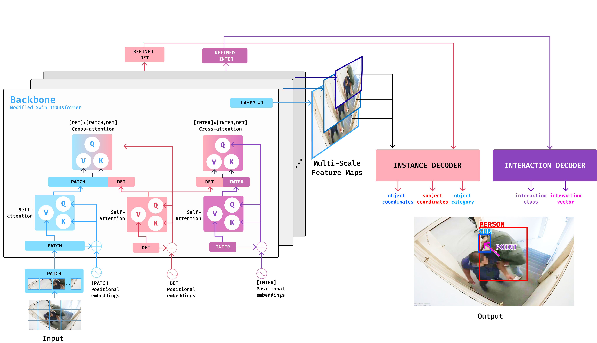
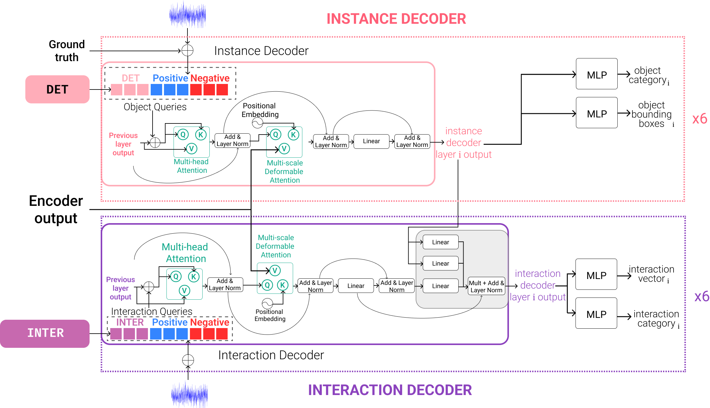

# Automated Aggressive Action Detection System (Server)
Server-side code which houses and runs the Deep Learning Model with input provided by the client.

The client architecture which calls the server can be found [here](https://github.com/MCS18-2022/aaads-client).

Our implemented model architecture is illustrated in the figure below. It is a one-stage HOI detector which uses a powerful Swin transformer [1] backbone for multi-scale feature extraction which is then passed into an Encoder-less transformer network. This network performs global feature aggregation to refine queries which are then used to make the final predictions. The model takes in $n$ video frames in a batch (Note that only one frame is showed in the figure below for visual clarity) though no relationship is assumed between the images in the same batch, as mapping spatio-temporal relationships between dense image data is very resource-intensive. It maintains the core transformer architecture which was initially proposed, however optimizations and additional techniques have been introduced to the architecture, they are detailed further below.

## Results

The figure below shows the qualitative predictions of our model for different confidence score thresholds. The larger the confidence score threshold, the more certain the model must be about the prediction to keep it (rather than filtering it out).

The table below shows the evaluation of the model for various confidence score thresholds.
| Confidence Scores               | 0.4  | 0.5  | 0.6  | 0.7  |
|---------------------------------|------|------|------|------|
| mean Average Precision (mAP, %) | 45.2 | 61.0 | **81.9** | 60.4 |

As you can see the optimal accuracy is obtained with a threshold of 0.6, i.e. model has to be fairly certain that there is an aggressive interaction to report it. Below, we give the overall accuracy of the model (with 0.6 confidence score threshold) and also break down the accuracy of the model for relevant interaction categories:

| Interaction Type                | Overall | "Point" | "Swing" | "Hold" |
|---------------------------------|---------|---------|---------|--------|
| mean Average Precision (mAP, %) | 81.9    | 94.1    | 60.3    | 91.3   |

Finally, we report the frames per second (FPS) of the model with different batch sizes:
| Batch Size              | 1    | 2     | 3     | 4     | 5     | 6     |
|-------------------------|------|-------|-------|-------|-------|-------|
| Frames Per Second (FPS) | 9.20 | 14.53 | 17.24 | 17.65 | 18.50 | 18.91 |

As you can se the larger the batch size the larger the FPS, this is because our model is highly parallelized, therefore the larger the number of images input into the model at once, the more images can be processed within a second.

## Notable Novelties
In this section we detail major modifications performed to tailor the model for our usecase:

### Backbone
The backbone is an integral part of contemporary Deep Learning models as it forms the foundation upon which the rest of the model depends on. Backbones are typically general-purpose models which have been pre-trained on large amounts of data with the hope that it is able to capture underlying characteristics of the input domain, for example-- edges, shapes, patterns for the visual domain. Our backbone parses the dense input image and extracts only those features which are relevant to the task at hand.

**Modifications:** The original proposed backbone was a Convolutional Neural Network (CNN). However, as we wanted to improve both the speed and accuracy of our model, we decided early on to upgrade this to a Vision Transformer (ViT) [2] and particularly one of the best performing general-purpose Computer Vision backbones -- the Swin transformer [1]. This transformer architecture splits the input image into $n\times n$ patches, referred to as `[PATCH]` tokens which are responsible for encoding the relevant image features. Alongside this, we implement the integration of the `[DET]` tokens, which are learnable queries responsible for the prediction of object bounding boxes and category labels, into the backbone itself, similar to ViDT [3]. Furthermore, we adapt this for HOI detection by inserting a separate set of learnable queries -- `[INTER]` tokens, which are responsible for classifying interactions -- into the backbone as well.

The structure of a single layer of our modified-Swin transformer backbone can be seen in the figure above. For all three types of tokens, self-attention is performed which refines each set of tokens by performing global aggregation. This is followed by two cross-attention mechanisms:

- `[DET]` x `[PATCH, DET]` cross-attention: `[DET]` tokens refined from the self-attention mechanism are concatenated to the refined `[PATCH]` tokens forming `[PATCH, DET]` tokens. The refined `[DET]` tokens then act as the queries which determine which features to aggregate to form `[DET]` tokens for the next layer. This allows the `[DET]` tokens to pay attention to elements of the `[PATCH]` tokens. In other words, the `[DET]` tokens are refined using image feature context extracted by the `[PATCH]` tokens.
- `[INTER]` x `[INTER, DET]` cross-attention: `[INTER]` tokens refined from the self-attention mechanism are concatenated to the refined `[DET]` tokens forming `[INTER, DET]` tokens. The refined `[INTER]` tokens then act as the queries which determine which features to aggregate when forming the `[INTER]` tokens for the next layer. This allows the `[INTER]` tokens to pay attention to elements of the `[DET]` tokens. The rationale behind this configuration is the hypothesis that interactions fundamentally depend on object information (Note that humans are considered objects as well within this context).

The output of the backbone is thus the refined `[PATCH]`, `[DET]`, and `[INTER]` tokens.

### Instance Decoder
The Instance Decoder is the first of two parallel decoders which takes as input the refined `[PATCH]` and `[DET]` tokens from the backbone and is responsible for detecting the objects within a given image. This decoder is composed of $6\times$ Instance Decoder Layers, the structure of one of these can be seen in the figure above. It first performs self-attention on the `[DET]` tokens to further refine them then performs multi-scale deformable cross-attention with the `[PATCH]` tokens. Note that there are three main differences between the cross-attention in this decoder and the one in the backbone:

- The cross-attention in the Swin backbone binds the `[DET]` tokens to the `[PATCH]` tokens, thus cross-attention is of the form: `[DET]` x `[PATCH, DET]` whereas in the decoder, cross-attention takes the form: `[DET]` x `[PATCH]`.
- The `[PATCH]` tokens used for cross-attention in the decoder is a concatenation of _all_ `[PATCH]` tokens from all Swin layers. This is how we perform multi-scale feature aggregation. On the other hand the cross-attention in the backbone only uses the `[PATCH]` tokens from the previous layer.
- Cross-attention in the decoder uses deformable attention to reduce the time-complexity of the operation whereas the cross-attention in the decoder does not.

Finally the refined `[DET]` tokens are fed into MLPs which outputs the following predictions:

- Subject bounding box coordinates
- Object bounding box coordinates
- Object category

**Modifications:** Contrastive denoising is utilized to further improve convergence rate. Here, noise generated from a uniform distribution is added to the ground-truth object bounding box coordinates. An equal number of positive and negative samples are generated wherein positive samples involve the addition of noise  $<=\lambda_1=1.0$ whereas negative samples are generated by adding noise $>\lambda_1$. For the ground-truth category, we randomly flip the values of the one-hot encoding vector to simulate noise.

These noised queries are then concatenated with the `[DET]` tokens from the backbone and undergo the same operations as these `[DET]` tokens. However, for the self-attention, a mask is generated which prevents the `[DET]` tokens from paying attention to the noised queries which would constitute as "cheating" since they contain information about the ground-truth values it would not otherwise have, for example, during inference time.

Finally, they are fed into MLPs which attempts to reconstruct the original ground-truth bounding box coordinates and category label. 

**Interaction Decoder**
The Interaction Decoder is the second parallel decoder in our architecture. It takes in the refined `[PATCH]` and `[INTER]` tokens and is responsible for detecting the interactions present in an image and to categorize them. Similar to the Instance Decoder, it is also composed of $6\times$ Interaction Decoder Layers, the structure of one of these layers is shown in the figure above. 

It first performs self-attention on the `[INTER]` tokens to further refine them, then performs multi-scale deformable cross-attention with the `[PATCH]` tokens. Note that in the backbone, the cross-attention involving `[INTER]` tokens was strictly between `[INTER]` and `[DET]` tokens only.

**Instance-Aware Attention Module** -- is a unique feature of the interaction decoder which takes the object detection predictions from the Instance Decoder with the output from the `[INTER]` x `[PATCH]` module and performs cross-attention between both outputs. This module is important in ensuring high interaction classification accuracy as interactions are inherently dependent on the subject and object features.

Finally the refined `[INTER]` tokens from this module are fed into two MLPs which output predictions for:

- Interaction category

The interaction vector is obtained from the center points of the subject and object bounding boxes obtained from the Instance Decoder.

**Modifications:** Contrastive denoising is also utilized for the Interaction Decoder where noise is injected into interaction category by randomly flipping the values of the one-hot encoding vector. These noised queries are concatenated with the `[INTER]` tokens from the backbone and undergo the same operations as these `[INTER]` tokens with the exception that a mask is applied during self-attention to prevent the `[INTER]` tokens from paying attention to the nosied queries.

Finally, the noised queries are fed into MLPs which attempts to reconstruct the original ground-truth interaction category. 

### References
[1] Z. Liu et al., 'Swin transformer: Hierarchical vision transformer using shifted windows', in _Proceedings of the IEEE/CVF International Conference on Computer Vision_, 2021, pp. 10012–10022.

[2] A. Dosovitskiy et al., 'An image is worth 16x16 words: Transformers for image recognition at scale', _arXiv preprint arXiv:2010_. 11929, 2020.

[3] H. Song et al., 'ViDT: An Efficient and Effective Fully Transformer-based Object Detector', in _International Conference on Learning Representation_, 2022.
